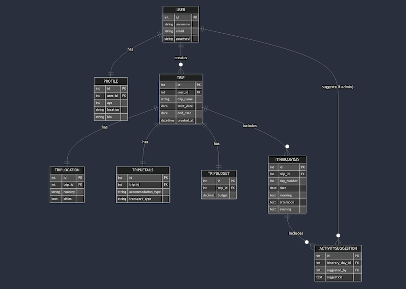

# TripMaster

TripMaster is a trip planning app which is designed to take the stress out of organising and planning trips all over the world. The app is targeted towards users who like to travel.

The live link can be found here - 

## Table of Contents

  
## User Experience (UX)

### User Stories

- As a Site User I can register an account so that I can

### Design

#### Colour Scheme

#### Imagery

#### Fonts

#### Wireframes

## Agile Methodology

Github projects was used to manage the development process using an agile approach. Please see link to project board 

## Data Model

This is the data model I designed. It has the Django built-in user model that handles authentication and basic user information. The profile extends the User model with added personal information. Trip is the central entity, which has a one-to-one relationship with Trip Location, Trip Details, Trip Budget and Itinerary, in which the itinerary can have have multiple days.

## Testing

### HTML

HTML was passed through the W3C validator with no errors.

| Page                  Result
|----------------------|------------|
|      
| base.html            | No errors  | 
| home.html            | No errors  |
| all.trips.html       | No errors  | 
| create_trip.html     | No errors  | 
| delete_trip.html     | No errors  | 
| edit_trip.html       | No errors  | 
| my_trips.html        | No errors  | 
| suggest_activity.html| No errors  | 
| trip_details.html    | No errors  |
| profile.html         | No errors  |  
| delete_profile.html  | No errors  | 
| edit_profile.html    | No errors  | 
| login.html           | No errors  |
| signup.html          | No errors  |
| 403.html             | No errors  |
| 404.html             | No errors  | 
| 500.html             | No errors  | 

### CSS

CSS was passed through W3C validator with no errors.

### JavaScript

JavaScript was passed through JShint with no errors.

### Python

Python code was passed through the PEP8 CI linter with no errors.

### Lighthouse

Lighthouse validation was run on all pages (both mobile and desktop).  Here are the scores: 

| Page           | Performance  | Accessibility | Best Practices  | SEO |
|----------------|:------------:|:-------------:|:---------------:|:---:|
|                |              |               |                 |     |
| Desktop  
|                |              |               |     
| Home           |          97  |           98  |             100 | 100 |
| My Trips       |          98  |           98  |             100 | 100 |
| Trip Details   |          99  |           98  |             100 | 100 |
| Delete trip*   |          99  |           98  |             100 | 100 |
| Create trip*   |          99  |           98  |             100 | 100 |
|SuggestActivity |          100 |           100 |             100 | 100 |
| Delete Trip    |          100 |           100 |             100 | 90  |
| Edit Trip      |          90  |           100 |             100 | 100 |
|All Trips(admin)|          89  |           98  |             100 | 90  |
| Profile        |          98  |           98  |             100 | 100 |
| Login          |          99  |           99  |             100 | 100 |
| Signup         |          100 |           99  |             100 | 100 |
| Edit Profile   |          98  |           100 |             100 | 100 |
| Delete Profile |          98  |           100 |             100 | 91  |

## Security Features

### User Authentication

### Form Validation
If incorrect or empty data 

### Database Security
The database url and secret key are stored in the .env file to 

Cross-Site Request Forgery (CSRF) tokens were used on all forms throughout this site.

## Features

### Header

**Logo**

**Navigation Bar**

### Footer

### Home Page

### User Account Pages

**Sign Up**

**Log In**

**Log Out**

- Django allauth was installed and used to create Log in and Log out functionality. 
- Success messages inform the user if they have logged in/ logged out successfully.

### Programs used
- [Django](https://www.djangoproject.com/): main python framework used in the development of this project.
- [PostgreSQL](https://www.postgresql.org/) used as the database for this project.
- [Heroku](https://dashboard.heroku.com/login) - used as the cloud based platform to deploy the site on.
- [Balsamiq](https://balsamiq.com/) - used to generate Wireframe images.
- [Chrome Dev Tools](https://developer.chrome.com/docs/devtools/) - used for overall development and testing.
- [Font Awesome](https://fontawesome.com/) - used for icons.
- [GitHub](https://github.com/) - used for agile tool.
- [Google Fonts](https://fonts.google.com/) - used to import fonts.
- [W3C](https://www.w3.org/) - used for HTML & CSS Validation.
- [PEP8 CI Linter](https://pep8ci.herokuapp.com/) - used to validate all the Python code.
- [Jshint](https://jshint.com/) - used to validate javascript.
- [Favicon](https://favicon.io/) - used to create the favicon.
- [Mermaid](https://mermaid.live/) - used to create the database schema design
- [Bootstrap 5](https://getbootstrap.com/docs/5.0/):Framework for developing responsiveness and styling

### CRUD

 

### Page

### Page

### Error Pages

Custom Error Pages were created to give the user more information on the error 

### Future Features

## Deployment - Heroku

To deploy this page to Heroku from its GitHub repository, the following steps were taken:

### Create the Heroku App:

### Attach the Postgres database:

### Update Heroku Config Vars

### Deploy

## Forking this repository

## Cloning this repository
To clone this repository follow the below steps: 

## Languages

- Python
- HTML
- CSS
- Javascript

## Frameworks - Libraries - Programs Used
- [Django](https://www.djangoproject.com/): Main python framework used in the development of this project
- [Django-allauth](https://django-allauth.readthedocs.io/en/latest/installation.html): authentication library used to create the user accounts
- [PostgreSQL](https://www.postgresql.org/) was used as the database for this project.
- [Heroku](https://dashboard.heroku.com/login) - was used as the cloud based platform to deploy the site on.
- [Balsamiq](https://balsamiq.com/) - Used to generate Wireframe images.
- [Chrome Dev Tools](https://developer.chrome.com/docs/devtools/) - Used for overall development 
- [GitHub](https://github.com/) - Used for version control and agile tool.
- [Google Fonts](https://fonts.google.com/) - Used to import and alter fonts on the page.
- [W3C](https://www.w3.org/) - Used for HTML & CSS Validation.
- [PEP8 Online](http://pep8online.com/) - used to validate all the Python code
- [Jshint](https://jshint.com/) - used to validate javascript
- [Grammerly](https://app.grammarly.com/) - used to proof read the README.md
- [Crispy Forms](https://django-crispy-forms.readthedocs.io/en/latest/) used to manage Django Forms

## Credits

- [W3Schools](https://www.w3schools.com/)

- [Pexels](https://www.pexels.com/): All imagery on the site was sourced from Pexels.com

- [Code Institute - Blog Walkthrough Project](https://github.com/Code-Institute-Solutions/Django3blog)
- 

## Acknowledgments

credits for code/ code logic: cloning the form, updating the form field names and IDs, clearing the input values, and incrementing the day number(Brennan Tymrak, https://www.brennantymrak.com/articles/django-dynamic-formsets-javascript)
for overriding instance in itinerary: https://docs.djangoproject.com/en/5.1/topics/forms/modelforms/#inline-formsets

Views : https://simpleisbetterthancomplex.com/tutorial/2017/02/18/how-to-create-user-sign-up-view.html
Form create trip inspo: https://www.youtube.com/watch?v=X8ECf3Ow3ww&t=1116s
JS progress bar: https://stackoverflow.com/questions/49460091/javascript-progressbar-update-on-the-fly
and https://www.youtube.com/watch?v=CCtgLbL4qE8 
JS Dynamic form: https://medium.com/@AlexanderObregon/beginners-guide-to-creating-dynamic-forms-with-javascript-10aef6a8843d
Date picker: https://stackoverflow.com/questions/47066555/remove-time-after-converting-date-toisostring
https://javascript.plainenglish.io/why-cloning-html-templates-is-a-must-know-trick-425be9ee664b
EVENTUALLY USED: https://www.youtube.com/watch?v=8xb9s3jnRF8&t=499s  wizard
https://awstip.com/django-inline-formset-factory-with-examples-27576b915b5a (https://archive.ph/20241031172621/https://awstip.com/django-inline-formset-factory-with-examples-27576b915b5a)

USED:
https://www.pexels.com/search/vacation/?color=fff3cd&orientation=landscape
https://fonts.google.com/selection/embed
https://imageresizer.com/

BUGS= getting 405 error when clicking logout, fixed by changing the url
some users do not have a Profile associated with them- fixed by using django signals to auto make profile when sign up.
couldnt get the country form field to work with google api- reliased i was using the wrong ID.

sign up html getting errors- field help texts weren't being wrapped correctly within the expected HTML elements. fixed by changing {{ form.as_p }} to {{ form.as_div }}