# TripMaster

TripMaster is a trip planning app which is designed to take the stress out of organising and planning trips all over the world. The app is targeted towards users who like to travel.

The live link can be found here - [TripMaster](https://travelplannerapp-889b39b313ee.herokuapp.com/)

## Table of Contents

  
## Features

## User Stories

-  As a user, I want to sign up with a username and password so that I can create an account.
-  As a user, I want to log in so that I can access my trips.
-  As a user, I want to log out securely so that my account remains private.
-  As a user, I want to add a new trip so that I can plan my travels.
-  As a user, I want to see all my saved trips in a dashboard format so I can easily manage them.
-  As a user, I want to click on a trip to see its details so that I can review my plans.
-  As a user, I want to modify a trip’s details so that I can update my plans.
-  As a user, I want to remove a trip so that I can keep my trip list organized.
-  As a user, I want to receive confirmation messages when I create, edit, or delete a trip so that I know my actions were successful.
-  As a user, I want to have a profile, so that I can view and update my personal information.
-  As an administrator, I can suggest activities for itinerary days so regular users benefit from expert recommendations.

## Design

#### Colour Scheme

This particular colour scheme was chosen as the colours are calming, earthy, natural and welcoming which feels fitting for a travel planning site. I used the colours throughout the website so that the design remains cohesive.

#### Imagery

The one image on the site was taken from Pexels and compressed for optimisation. I used CSS rules to style it and make it responsive.

#### Fonts

I chose Poppins and Lato as my fonts. I find Poppins stands out with its modern and fun look, making it great for headlines and key elements. Lato is very readable and works well for body text. Together, they provide both style and clarity for my site.

#### Wireframes

 
Homepage

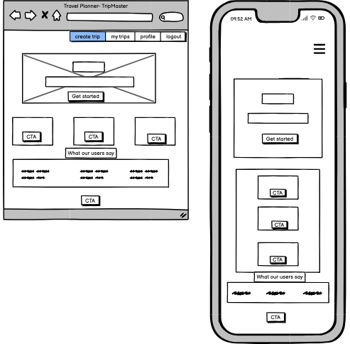

Create Trip

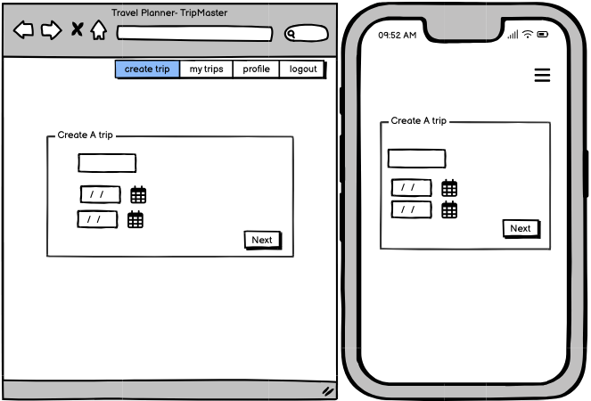

My Trips

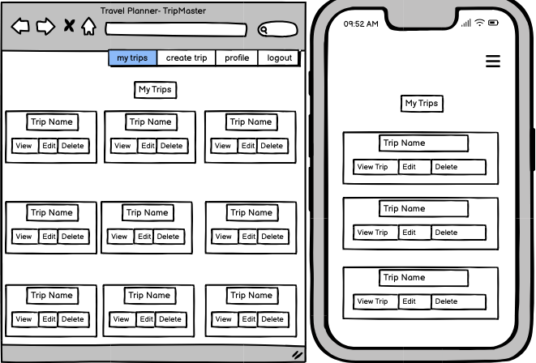

Edit Trip

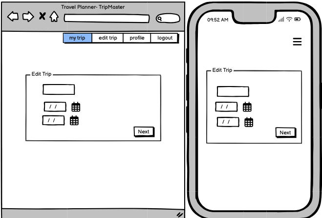

Trip Details

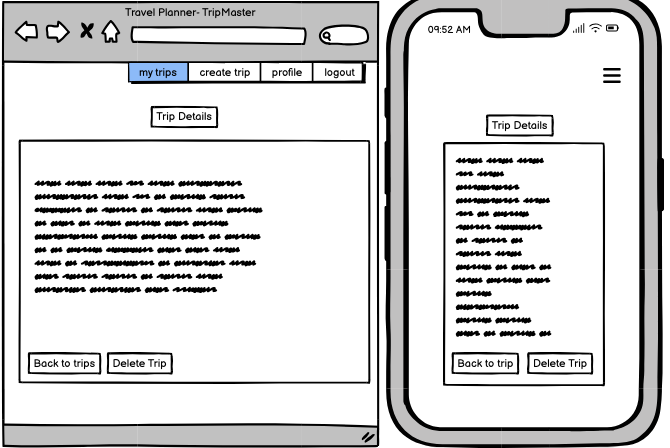

Delete Trip

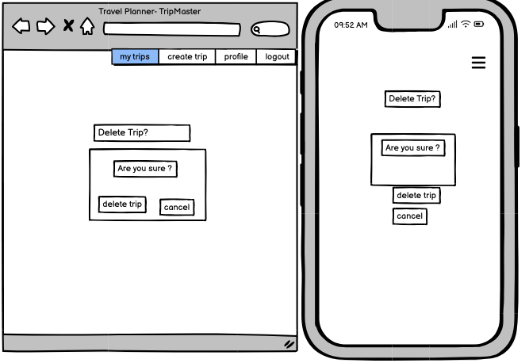

All Trips (admin)

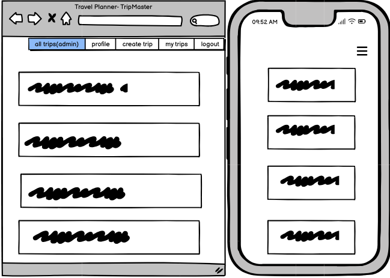

Profile

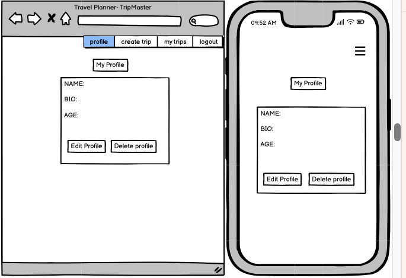

Login

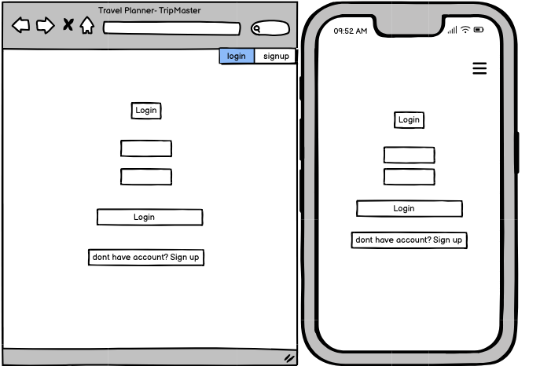

Edit Profie

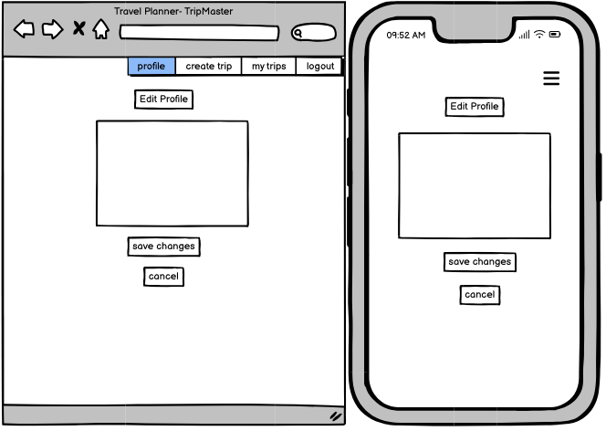

Delete Profile

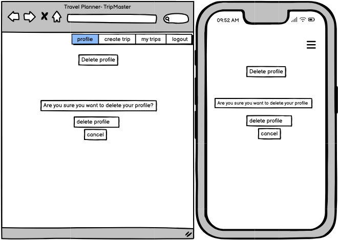

Sign Up

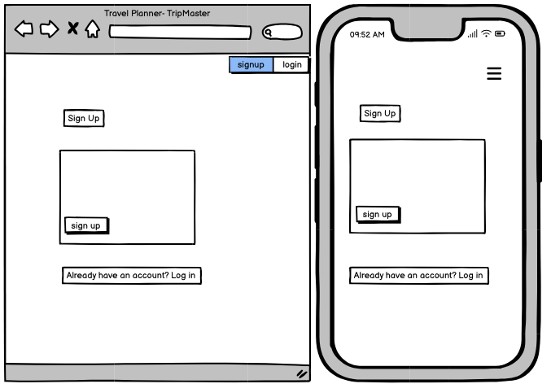

Suggest Activity

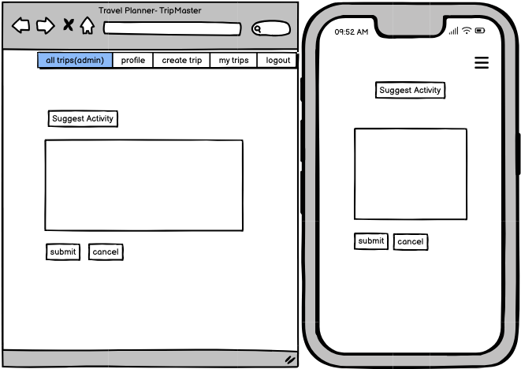

Error Pages

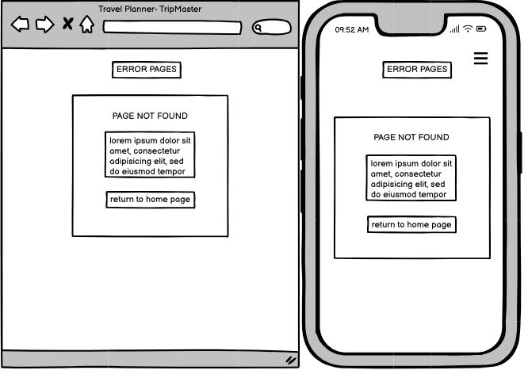

## Agile Methodology

Github projects was used to manage the development process using an agile approach. Please see link to my project board:

[Project Board](https://github.com/users/Amelia5p/projects/7/views/1)

## Data Model

This is the data model I designed. It has the Django built-in user model that handles authentication and basic user information. The profile extends the User model with added personal information. Trip is the central entity, which has a one-to-one relationship with Trip Location, Trip Details, Trip Budget and Itinerary, in which the itinerary can have have multiple days.

## Testing

### HTML

HTML was passed through the W3C validator with no errors.

| Page                   | Result     |
|------------------------|------------|
| base.html              | No errors  |
| home.html              | No errors  |
| all.trips.html         | No errors  |
| create_trip.html       | No errors  |
| delete_trip.html       | No errors  |
| edit_trip.html         | No errors  |
| my_trips.html          | No errors  |
| suggest_activity.html  | No errors  |
| trip_details.html      | No errors  |
| profile.html           | No errors  |
| delete_profile.html    | No errors  |
| edit_profile.html      | No errors  |
| login.html             | No errors  |
| signup.html            | No errors  |
| 403.html               | No errors  |
| 404.html               | No errors  |
| 500.html               | No errors  |

### CSS

CSS was passed through W3C validator with no errors.

### JavaScript

JavaScript was passed through JShint with no errors.

### Python

Python code was passed through the PEP8 CI linter with no errors.

### Lighthouse

Lighthouse validation was run on all pages (both mobile and desktop).  Here are the scores: 

| Page           | Performance  | Accessibility | Best Practices  | SEO |
|----------------|:------------:|:-------------:|:---------------:|:---:|
|                |              |               |                 |     |
| Desktop  
|                |              |               |     
| Home           |          97  |           98  |             100 | 100 |
| My Trips       |          98  |           98  |             100 | 100 |
| Trip Details   |          99  |           98  |             100 | 100 |
| Delete trip*   |          99  |           98  |             100 | 100 |
| Create trip*   |          99  |           98  |             100 | 100 |
|SuggestActivity |          100 |           100 |             100 | 100 |
| Delete Trip    |          100 |           100 |             100 | 90  |
| Edit Trip      |          90  |           100 |             100 | 100 |
|All Trips(admin)|          89  |           98  |             100 | 90  |
| Profile        |          98  |           98  |             100 | 100 |
| Login          |          99  |           99  |             100 | 100 |
| Signup         |          100 |           99  |             100 | 100 |
| Edit Profile   |          98  |           100 |             100 | 100 |
| Delete Profile |          98  |           100 |             100 | 91  |

## Browser Testing
The Website was tested on Google Chrome, Firefox, Safari browsers with no issues.

## Security Features

### User Authentication

### Form Validation
Incorrect or in certain cases empty data in forms is not accepted and the user is made aware.

### Database Security
The database url and secret key are stored in the .env file to prevent unwanted connections.

Cross-Site Request Forgery (CSRF) tokens were used on all forms throughout this site.

## Features

### Navigation Bar

### Footer

### Home Page

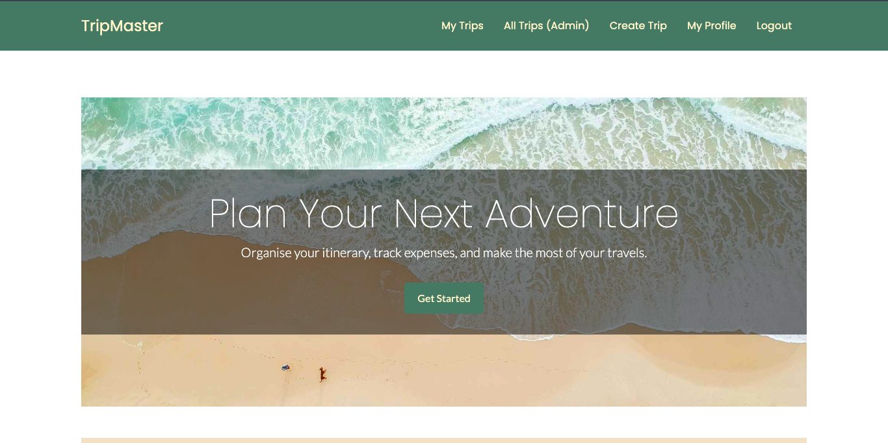
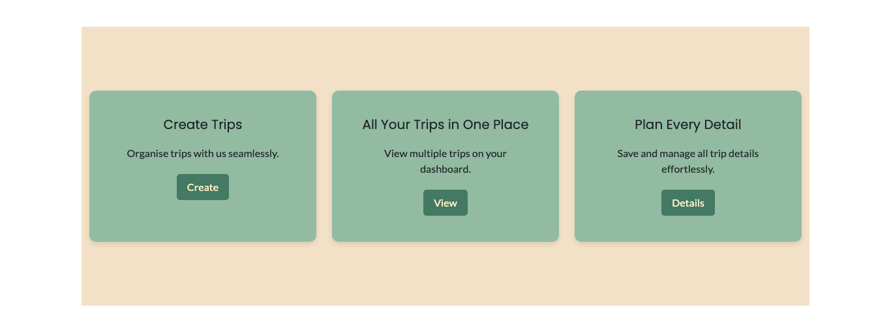
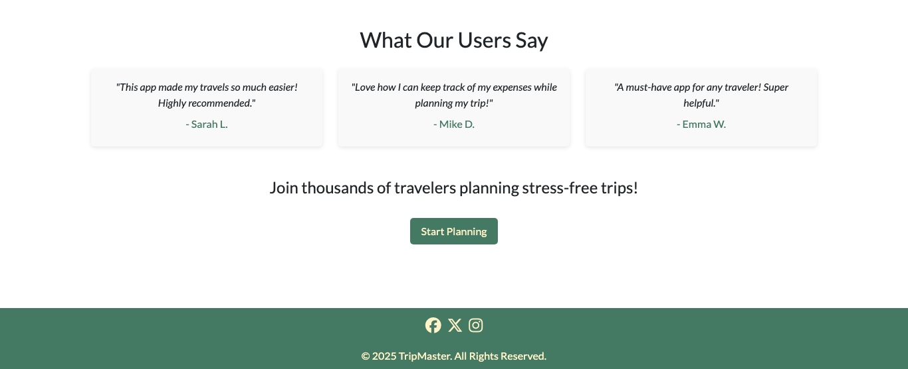

### Create Trip Page

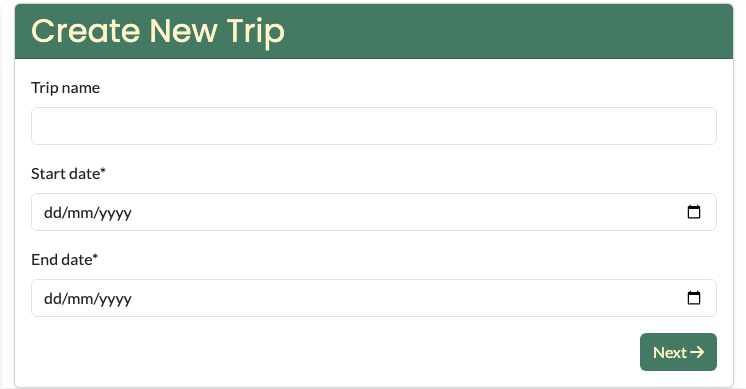
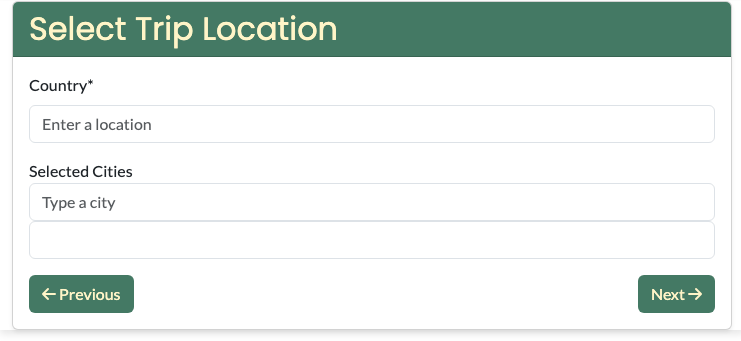
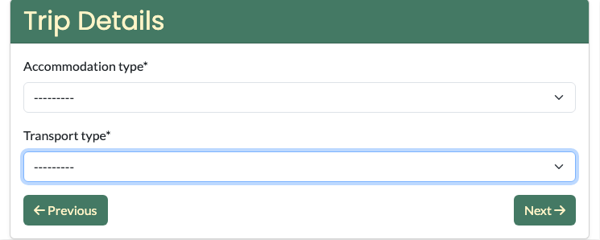
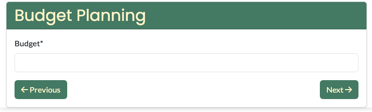
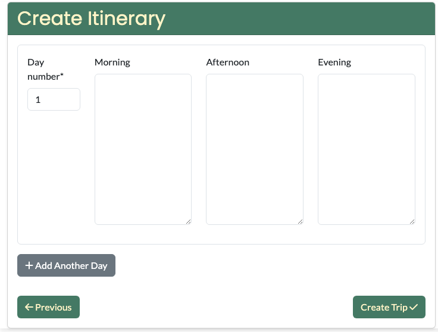

### Edit Trip Page

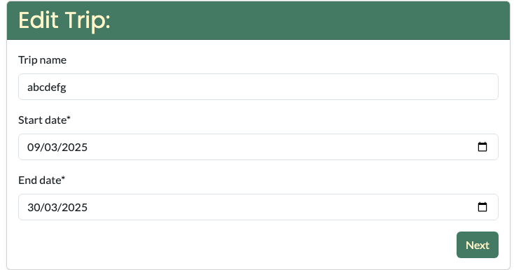

### Delete Trip Page

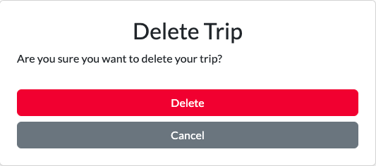

### My Trips Page

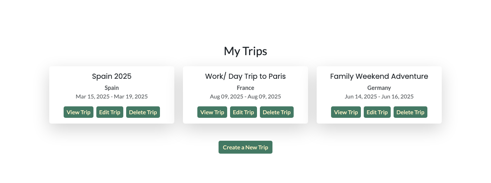

### Trip Details Page

### All Trips Page

### User Account Pages

**Sign Up**

**Log In**

**Log Out**

- Django allauth was installed and used to create Log in and Log out functionality. 
- Success messages inform the user if they have logged in/ logged out successfully.

### Programs used
- [Django](https://www.djangoproject.com/): main python framework used in the development of this project.
- [PostgreSQL](https://www.postgresql.org/) used as the database for this project.
- [Heroku](https://dashboard.heroku.com/login) - used as the cloud based platform to deploy the site on.
- [Balsamiq](https://balsamiq.com/) - used to generate Wireframe images.
- [Chrome Dev Tools](https://developer.chrome.com/docs/devtools/) - used for overall development and testing.
- [Font Awesome](https://fontawesome.com/) - used for icons.
- [GitHub](https://github.com/) - used for agile tool.
- [Google Fonts](https://fonts.google.com/) - used to import fonts.
- [W3C](https://www.w3.org/) - used for HTML & CSS Validation.
- [PEP8 CI Linter](https://pep8ci.herokuapp.com/) - used to validate all the Python code.
- [Jshint](https://jshint.com/) - used to validate javascript.
- [Favicon](https://favicon.io/) - used to create the favicon.
- [Mermaid](https://mermaid.live/) - used to create the database schema design
- [Bootstrap 5](https://getbootstrap.com/docs/5.0/):Framework for developing responsiveness and styling
- [Am I responsive](https://ui.dev/amiresponsive) used for responsive picture
- [Coolors](https://coolors.co/) used for creating colour palette

### CRUD

 

### Page

### Page

### Error Pages

Custom Error Pages were created to give the user more information on the error 

### Future Features

## Deployment - Heroku

To deploy this page to Heroku from its GitHub repository, the following steps were taken:

### Create the Heroku App:

### Attach the Postgres database:

### Update Heroku Config Vars

### Deploy

## Forking this repository

## Cloning this repository
To clone this repository follow the below steps: 

## Languages

- Python
- HTML
- CSS
- Javascript

## Frameworks - Libraries - Programs Used
- [Django](https://www.djangoproject.com/): Main python framework used in the development of this project
- [Django-allauth](https://django-allauth.readthedocs.io/en/latest/installation.html): authentication library used to create the user accounts
- [PostgreSQL](https://www.postgresql.org/) was used as the database for this project.
- [Heroku](https://dashboard.heroku.com/login) - was used as the cloud based platform to deploy the site on.
- [Balsamiq](https://balsamiq.com/) - Used to generate Wireframe images.
- [Chrome Dev Tools](https://developer.chrome.com/docs/devtools/) - Used for overall development 
- [GitHub](https://github.com/) - Used for version control and agile tool.
- [Google Fonts](https://fonts.google.com/) - Used to import and alter fonts on the page.
- [W3C](https://www.w3.org/) - Used for HTML & CSS Validation.
- [PEP8 Online](http://pep8online.com/) - used to validate all the Python code
- [Jshint](https://jshint.com/) - used to validate javascript
- [Grammerly](https://app.grammarly.com/) - used to proof read the README.md
- [Crispy Forms](https://django-crispy-forms.readthedocs.io/en/latest/) used to manage Django Forms

## Credits

- [W3Schools](https://www.w3schools.com/)

- [Pexels](https://www.pexels.com/): All imagery on the site was sourced from Pexels.com

- [Code Institute - Blog Walkthrough Project](https://github.com/Code-Institute-Solutions/Django3blog)
- 

## Acknowledgments

credits for code/ code logic: cloning the form, updating the form field names and IDs, clearing the input values, and incrementing the day number(Brennan Tymrak, https://www.brennantymrak.com/articles/django-dynamic-formsets-javascript)
for overriding instance in itinerary: https://docs.djangoproject.com/en/5.1/topics/forms/modelforms/#inline-formsets

Views : https://simpleisbetterthancomplex.com/tutorial/2017/02/18/how-to-create-user-sign-up-view.html
Form create trip inspo: https://www.youtube.com/watch?v=X8ECf3Ow3ww&t=1116s
JS progress bar: https://stackoverflow.com/questions/49460091/javascript-progressbar-update-on-the-fly
and https://www.youtube.com/watch?v=CCtgLbL4qE8 
JS Dynamic form: https://medium.com/@AlexanderObregon/beginners-guide-to-creating-dynamic-forms-with-javascript-10aef6a8843d
Date picker: https://stackoverflow.com/questions/47066555/remove-time-after-converting-date-toisostring
https://javascript.plainenglish.io/why-cloning-html-templates-is-a-must-know-trick-425be9ee664b
EVENTUALLY USED: https://www.youtube.com/watch?v=8xb9s3jnRF8&t=499s  wizard
https://awstip.com/django-inline-formset-factory-with-examples-27576b915b5a (https://archive.ph/20241031172621/https://awstip.com/django-inline-formset-factory-with-examples-27576b915b5a)

USED:
https://www.pexels.com/search/vacation/?color=fff3cd&orientation=landscape
https://fonts.google.com/selection/embed
https://imageresizer.com/

BUGS= getting 405 error when clicking logout, fixed by changing the url
some users do not have a Profile associated with them- fixed by using django signals to auto make profile when sign up.
couldnt get the country form field to work with google api- reliased i was using the wrong ID.

sign up html getting errors- field help texts weren't being wrapped correctly within the expected HTML elements. fixed by changing {{ form.as_p }} to {{ form.as_div }}